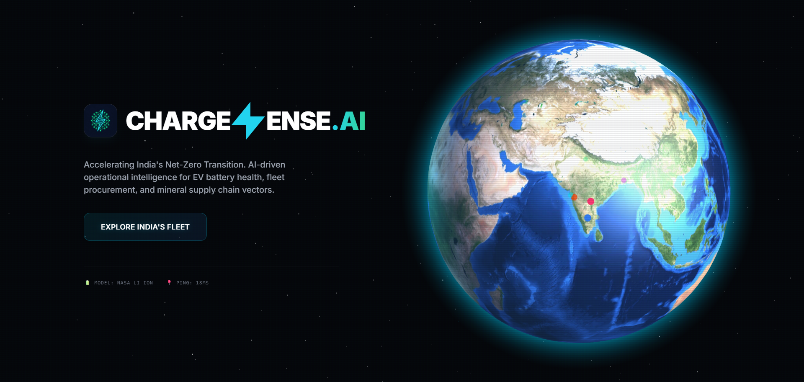
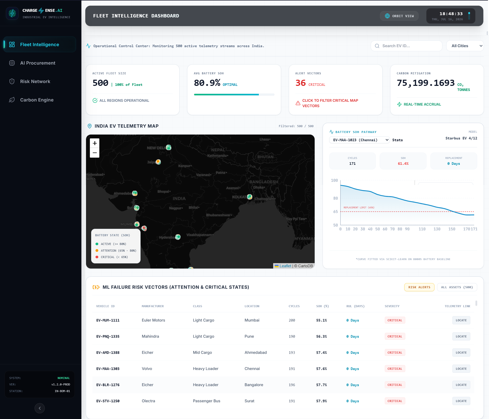
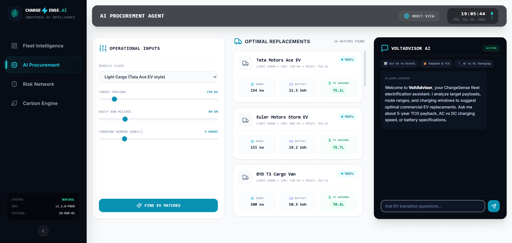
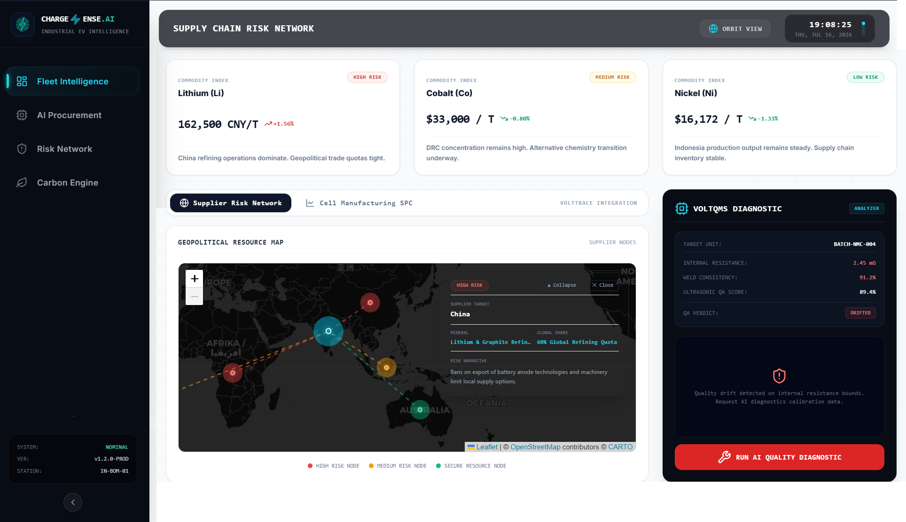
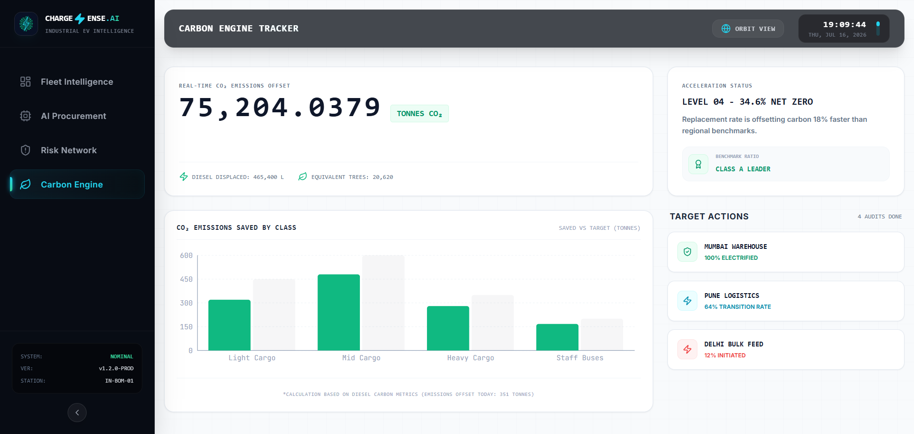

<div align="center">
  
  <h1>ChargeSense.AI - Industrial EV Telemetry & Predictive Analytics Platform</h1>
  <h3>Real-Time Battery SOH Forecasting, TCO Matching & Geopolitical Supply Chain Analytics</h3>
  <p><strong>Developed for the ET AI Hackathon 2.0 (Organized by The Economic Times)</strong></p>

  [](https://reactjs.org/)
  [](https://www.typescriptlang.org/)
  [](https://www.python.org/)
  [](https://fastapi.tiangolo.com/)
  [](https://groq.com/)
  [](https://threejs.org/)
</div>

---

## Platform Overview

**ChargeSense.AI** is a unified, full-stack EV fleet intelligence and logistics optimization portal engineered to transition siloed vehicle data into an actionable decision-making database. It enables Logistics Managers, Procurement Officers, Cell Quality Engineers, and Sustainability Officers to perform end-to-end operational workflows—ranging from spatial fleet tracking and predictive battery degradation monitoring to interactive co-offending network link-analysis and AI-assisted conversational query resolution.

The platform is designed to scale dynamically, integrating real-time telemetry inputs with LLaMA 3.3 conversational intelligence.

---

## System Architecture

The ChargeSense.AI platform is built on a decoupled serverless architecture:

* **Client-Side (React Client App):** A responsive React + TypeScript Single Page Application (SPA) utilizing Tailwind CSS for styling, Leaflet for spatial coordinates tracking, Recharts for battery capacity curves, and Three.js + GSAP for the cinematic 3D Earth landing page.
* **Backend API (FastAPI):** A high-performance Python ASGI web service handling data ingestion, predictions from locally trained Scikit-Learn regressors, commodity pricing feeds, and LLM completions via Groq Cloud APIs.

```
                     ┌───────────────────────────────┐
                     │         Three.js UI           │
                     │    3D Cinematic Earth Globe   │
                     └──────────────┬────────────────┘
                                    │ 
                                    │ GSAP Fly-in
                                    ▼
            ┌────────────────────────────────────────────────┐
            │             React (TypeScript) App             │
            │  ┌──────────┐  ┌──────────┐  ┌──────────────┐  │
            │  │ Leaflet  │  │ Recharts │  │ Lucide Icons │  │
            │  └──────────┘  └──────────┘  └──────────────┘  │
            └─────────┬─────────────────────────────┬────────┘
                      │                             │
          Axios HTTP  │                             │  Server-Sent Feeds
                      │                             │ 
                      ▼                             ▼
            ┌────────────────────────────────────────────────┐
            │            Python FastAPI Backend              │
            │  ┌───────────┐  ┌───────────┐  ┌─────────────┐ │
            │  │  Uvicorn  │  │  Pydantic │  │ SciKitLearn │ │
            │  └─────┬─────┘  └─────┬─────┘  └─────┬───────┘ │
            └────────┼──────────────┼──────────────┼─────────┘
                     │              │              │
                     ▼              ▼              ▼
               [Groq Cloud]   [NASA Li-Ion]   [17 OEM Spec
                 LLaMA-3.3      Databases     Cycle Models] 
                 
```

---

## Datasets Utilized & Synthesized

### 1. External Datasets Utilized (Raw Telemetry)
* **NASA Lithium-Ion Battery Aging Dataset:** Sourced from the NASA Prognostics Center of Excellence. This dataset includes continuous charge/discharge cycles for Li-ion cells under various operating conditions. We extracted discharge capacities vs. cycle numbers to train our State of Health (SOH) predictive models.

### 2. Synthesized Datasets Created (Custom Assets)
* **National EV Fleet Telemetry Database:** A custom-synthesized database tracking 500 commercial electric vehicles operational in India. It maps real-time coordinate clusters, city identifiers, cycle parameters, active status alerts, and carbon offset rates.
* **Indian OEM Commercial Specifications Database:** A ground-truth specs database mapping parameters for 17 leading Indian commercial EVs (including models from Tata Motors, Mahindra, Ashok Leyland, Olectra, and BYD). Maps battery pack capacities, payloads, ranges, and capital costs.
* **VoltQMS Assembly Batch Log:** Synthesized production logs tracking internal cell resistance (mOhm), weld penetration inconsistency ratios, ultrasonic QA scores, electrode coating deviations, and focal scanner calibration indices over 100 batch lines.

---

## Key Functional Modules & Features

### 1. 🪐 3D Cinematic Orbit Landing
* **Volumetric Earth Sphere:** A custom Three.js globe showing 7 distinct, color-coded transport terminal nodes across India.
* **Internal Breathing Pulses:** Breathing scale animations that pulse internally inside dot borders to prevent visual overlap.
* **GSAP Transition:** Zoom-fly camera timelines that navigate to India's coordinates upon entry.


*A high-fidelity Three.js 3D rotating Earth globe showing multi-nodal terminal locations across India. It features breathing beacon animations and GSAP fly-in camera timelines.*

### 2. 📊 Predictive Fleet Telemetry & Battery SOH
* **India Tracking Map:** A customized Leaflet coordinate dashboard pinning 500 active commercial EVs across transport lanes.
* **Degradation Analytics:** Plots real-time cycle decay capacity curves using regression parameters trained on the **NASA Lithium-Ion Battery Aging dataset**.
* **Failure Boundaries:** Highlights critical battery thresholds (SOH < 70%) to issue pre-emptive maintenance warnings.


*Real-time India tracking map pinning 500 active EVs with complete State of Health (SOH) capacity fade curves trained on NASA's Lithium-ion Battery Aging database.*

### 3. 🤖 AI Procurement Agent (VoltAdvisor)
* **Electrification TCO Matcher:** Filter payload requirements and range margins to match 17 commercial EV models.
* **Spec Ground-Truth Chatbot:** Integrates **Groq LLaMA 3.3 70B** to generate custom transition reports using ground-truth Indian OEM specifications (Tata, Ashok Leyland, Olectra).
* **Interactive Cards:** Selection clicks automatically query the chatbot to compile custom TCO profiles.


*The VoltAdvisor chatbot console connected to LLaMA 3.3. Prompts are seeded with ground-truth OEM specifications for payload and range requirements.*

### 4. 🗺️ Geopolitical Supply Chain Risk & QMS (VoltQMS)
* **Commodity Price Feeds:** Monitors indexes for Cobalt, Lithium, and Nickel.
* **Geopolitical Shipping Map:** Visualizes shipping channels from global mineral suppliers to India HQ with polyline risk color grading.
* **VoltQMS Quality Control:** Monitors manufacturing internal resistance in an SPC control chart. Anomalies trigger diagnostic LLaMA completions to recommend corrective actions.


*Interactive Leaflet world map tracking mineral shipping flows alongside Statistical Process Control (SPC) batch parameters for manufacturing defect diagnostics.*

### 5. 🌿 Real-Time Carbon Mitigation Ticker
* **High-Frequency offset counter:** Dynamic ticking counter updating every 100ms based on active EV savings indices.
* **Class Emissions:** Compare target vs. actual saved CO₂ by cargo dimensions.
* **Audits Checklist:** Progress logs tracking terminal electrification completions.


*A high-frequency rolling carbon ticker offsets cumulative tonnage in real-time, backed by transition audit checklist status for logistics terminals.*

---

## Installation & Local Setup

### Prerequisites
* Node.js (v18+)
* Python (v3.9+)

### Step 1: Install Frontend Dependencies
```bash
cd chargesense
npm install
```

### Step 2: Install Backend Dependencies
```bash
cd ../backend
pip install -r requirements.txt
```

### Step 3: Configure Environment Variables
Create a `.env` file in the `backend/` directory:
```env
GROQ_API_KEY=your_groq_api_key_here
```

---

## Running Locally

To run the full-stack application locally:

### Step 1: Start Backend Server
```bash
cd backend
python -m uvicorn main:app --port 8000 --reload
```

### Step 2: Start Frontend Application
```bash
cd chargesense
npm run dev
```

---

## Developer

* **Ashish Ranising** (GitHub: [@notar7](https://github.com/notar7))

---

<div align="center">
  <p><strong>Developed for the ET AI Hackathon 2.0 (Organized by The Economic Times)</strong></p>
  <p>© 2026 ChargeSense.AI. All rights reserved.</p>
</div>
