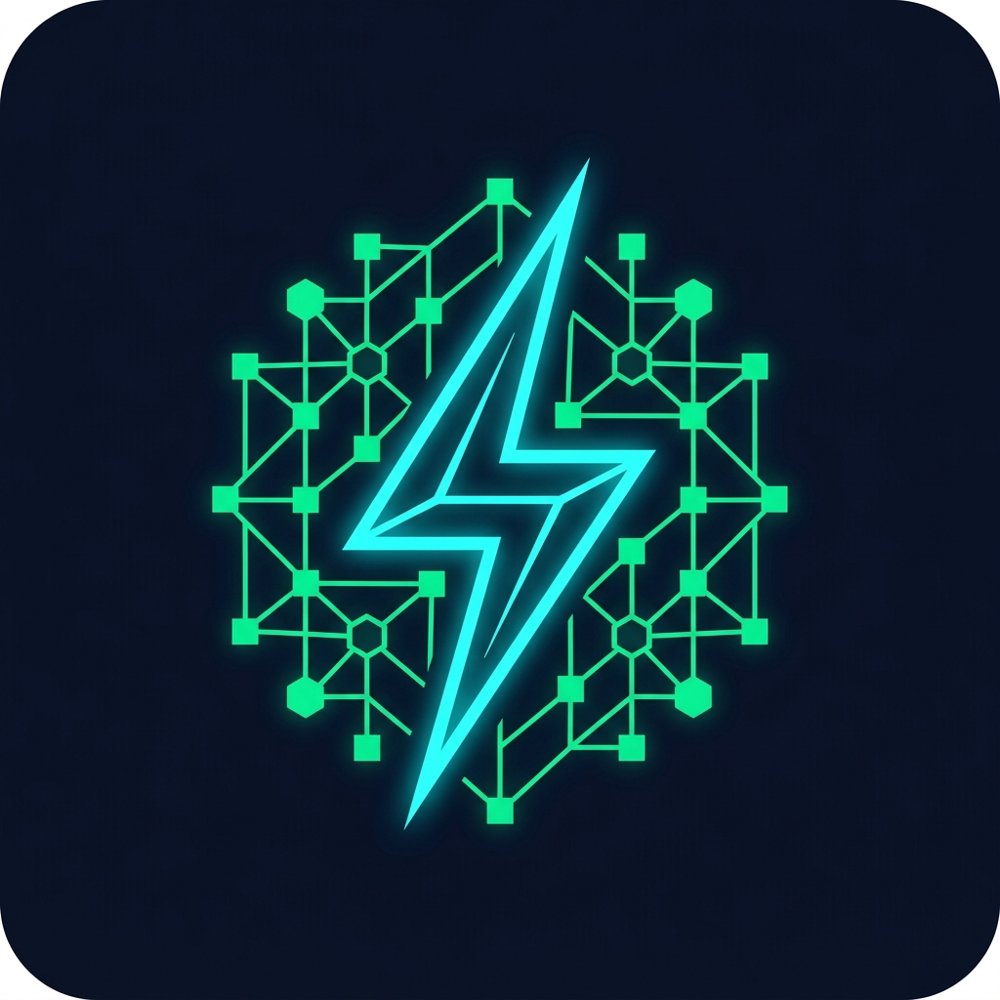

<p align="center">
  
</p>

<h1 align="center">⚡ ChargeSense.AI</h1>

<p align="center">
  <strong>Industrial EV Telemetry, AI Procurement, Geopolitical Supply Chain Risk & Battery Degradation Platform</strong>
</p>

<p align="center">
  <a href="https://github.com/notar7/ChargeSense.AI">
    
  </a>
  <a href="https://github.com/notar7/ChargeSense.AI/blob/main/LICENSE">
    
  </a>
  
  
  
</p>

---

## 📋 Table of Contents

- [🌐 Overview](#-overview)
- [✨ Key Features](#-key-features)
  - [1. 🪐 3D Cinematic Orbit View](#1-🪐-3d-cinematic-orbit-view)
  - [2. 📊 Predictive Fleet Telemetry & Battery SOH](#2-📊-predictive-fleet-telemetry--battery-soh)
  - [3. 🤖 AI Procurement Agent (VoltAdvisor)](#3-🤖-ai-procurement-agent-voltadvisor)
  - [4. 🗺️ Geopolitical Supply Chain Risk & QMS (VoltQMS)](#4-🗺️-geopolitical-supply-chain-risk--qms-voltqms)
  - [5. 🌿 Real-Time Carbon Mitigation Ticker](#5-🌿-real-time-carbon-mitigation-ticker)
- [🛠️ Architecture & Tech Stack](#️-architecture--tech-stack)
- [📦 Installation & Local Setup](#-installation--local-setup)
  - [Prerequisites](#prerequisites)
  - [Backend Setup](#backend-setup)
  - [Frontend Setup](#frontend-setup)
- [🔌 API Endpoints](#-api-endpoints)
- [🤝 Contributors & Credits](#-contributors--credits)

---

## 🌐 Overview

**ChargeSense.AI** is an advanced operational intelligence platform designed to manage and optimize India's expanding industrial EV logistics infrastructure. From monitoring battery state-of-health (SOH) using predictive aging algorithms to mitigating geopolitical risks in lithium-ion mineral supplies, ChargeSense.AI unifies operations, procurement, and sustainability inside a seamless, dark-themed, high-fidelity console.

Built for the **ET AI Hackathon 2026**, the platform solves complex decision-making bottlenecks for enterprise fleet transitions by combining live telemetry analytics, real-time macro-economic data, and LLM-driven diagnostic reasoning.

---

## ✨ Key Features

### 1. 🪐 3D Cinematic Orbit View
* **Visual Landing Experience:** Powered by a customized **Three.js** canvas rendering a rotating Earth globe with volumetric atmosphere shaders and custom starfields.
* **Beacons & Nodes:** Pinpoints major Indian transport terminals (Mumbai, Delhi, Chennai, Kolkata, Pune, Bangalore, Hyderabad) using distinct, glowing color nodes.
* **Non-Overlapping Micro-Pulses:** Features custom interior scaling and breathing mesh animations that prevent visual clutter or intersection.
* **Camera Fly-In:** Clicking "Explore India's Fleet" triggers a custom **GSAP** timeline that flies the camera into the coordinate space of the subcontinent before routing to the control room.

### 2. 📊 Predictive Fleet Telemetry & Battery SOH
* **Interactive Heatmaps:** Leverages a custom Leaflet overlay tracking 500 active commercial EVs across the country, color-coded by health status (Normal, Attention, Critical).
* **Battery Aging Models:** Implements linear regression models trained on **NASA's Lithium-Ion Battery Aging dataset** (monitoring cycle counts vs. capacity fade).
* **Actual vs. Predicted SOH Curves:** Interactive Recharts display vehicle operational history alongside forecasted degradation curves, highlighting failure points (SOH < 70%).

### 3. 🤖 AI Procurement Agent (VoltAdvisor)
* **Electrification TCO Matcher:** Operational sliders filter fleet payload requirements and range margins, querying the backend recommendations engine to find matches from a database of 17 commercial EV models.
* **Spec Ground-Truth Chatbot:** Integrates **Groq LLaMA 3.3 70B** to generate TCO reports. Prompts are seeded with ground-truth Indian OEM specifications (Tata, Ashok Leyland, Olectra) to block hallucinations.
* **Card Interactivity:** Clicking any matched vehicle instantly updates the chat console to compile a customized transition analysis for that model.

### 4. 🗺️ Geopolitical Supply Chain Risk & QMS (VoltQMS)
* **Risk Vectors & Commodity Index:** Monitors price indices for Cobalt, Lithium, and Nickel with real-time price trends.
* **Leaflet Geopolitical Map:** Maps international mineral shipping channels from global suppliers (DRC, Australia, Chile, Indonesia) back to ChargeSense India HQ, with polyline coordinates color-graded by political risk.
* **VoltQMS Quality Control:** Tracks electrode coating and internal resistance on cell manufacturing assembly lines. Outliers trigger a diagnostic modal that queries LLaMA 3.3 for root-cause mechanical calibration advice.

### 5. 🌿 Real-Time Carbon Mitigation Ticker
* **High-Frequency accrual:** A real-time sub-second ticker counting carbon offset tonnage using fleet emissions metrics (updating every 100ms for active visual feedback).
* **Cargo Class Breakdown:** Recharts bar charts compare saved vs. target emissions across Light Cargo, Mid Cargo, Heavy Cargo, and Staff Transport.
* **Transition Rollout Audits:** Tracks electrification checklist progression across the Mumbai, Pune, and Delhi regional hubs.

---

## 🛠️ Architecture & Tech Stack

```
                     ┌──────────────────────────────┐
                     │         Three.js UI          │
                     │    3D Cinematic Earth Globe  │
                     └──────────────┬───────────────┘
                                    │ GSAP Fly-in
                                    ▼
            ┌──────────────────────────────────────────────┐
            │             React (TypeScript) App           │
            │  ┌──────────┐  ┌──────────┐  ┌────────────┐  │
            │  │ Leaflet  │  │ Recharts │  │ Lucide Icons  │
            │  └──────────┘  └──────────┘  └────────────┘  │
            └───────┬──────────────────────────────┬───────┘
                    │                              │
                    │ Axios HTTP                   │ Server-Sent Feeds
                    ▼                              ▼
            ┌──────────────────────────────────────────────┐
            │            Python FastAPI Backend            │
            │  ┌──────────┐  ┌──────────┐  ┌────────────┐  │
            │  │  Uvicorn │  │  Pydantic│  │ SciKitLearn│  │
            │  └────┬─────┘  └────┬─────┘  └─────┬──────┘  │
            └───────┼─────────────┼──────────────┼─────────┘
                    │             │              │
                    ▼             ▼              ▼
              [Groq Cloud]   [NASA Li-Ion]  [17 OEM Spec
               LLaMA-3.3     Cycle Models]    Databases]
```

* **Frontend:** React 18, Vite, TypeScript, Tailwind CSS, Lucide React
* **Graphics & Mapping:** Three.js, GSAP (GreenSock), Leaflet, Recharts
* **Backend:** FastAPI (Python 3.9+), Uvicorn, Pydantic, Scikit-Learn
* **LLM Engine:** Groq Cloud SDK (LLaMA 3.3 70B Versatile) / Gemini Flash API (Fallback)

---

## 📦 Installation & Local Setup

### Prerequisites
* **Node.js** v18+ & **npm**
* **Python** v3.9+ & **pip**
* **Groq API Key** (or **Gemini API Key**)

### Backend Setup
1. Navigate to the backend directory:
   ```bash
   cd backend
   ```
2. Create and activate a virtual environment:
   ```bash
   python -m venv venv
   # On Windows:
   .\venv\Scripts\activate
   # On Unix/macOS:
   source venv/bin/activate
   ```
3. Install dependencies:
   ```bash
   pip install -r requirements.txt
   ```
4. Configure environment variables in a `.env` file inside the `backend/` directory:
   ```env
   GROQ_API_KEY=your_groq_api_key_here
   # Optional Fallback:
   GEMINI_API_KEY=your_gemini_api_key_here
   ```
5. Run the FastAPI server:
   ```bash
   python -m uvicorn main:app --port 8000 --reload
   ```
   The API will be available at `http://localhost:8000`.

### Frontend Setup
1. Navigate to the frontend directory:
   ```bash
   cd chargesense
   ```
2. Install Node packages:
   ```bash
   npm install
   ```
3. Set up the development server:
   ```bash
   npm run dev
   ```
4. Open your browser and navigate to `http://localhost:5173` (or the port specified by Vite).

---

## 🔌 API Endpoints

The FastAPI server exposes the following operational endpoints:

* `GET /api/fleet/overview`: Returns aggregated fleet size, average SOH, critical alarm counts, and current carbon metrics.
* `GET /api/fleet/vehicles`: Lists coordinates and capacity parameters for all 500 active vehicles.
* `GET /api/fleet/vehicle/{id}`: Predicts battery degradation curves using the local Scikit-Learn regression parameters.
* `POST /api/procurement/recommend`: Computes payload and range fit scores for commercial vehicles.
* `POST /api/agent/chat`: Forwards fleet reports and queries to Groq LLaMA 3.3 with pre-loaded OEM contexts.
* `GET /api/qms/batches`: Returns electrode thickness values, weld penetrations, and internal cell resistance for VoltQMS charts.
* `GET /api/carbon/savings`: Retreives real-time carbon mitigation stats.

---

## 🤝 Contributors & Credits

Developed by **Ashish Ranising** for the **ET AI Hackathon 2026**.

* **GitHub:** [@notar7](https://github.com/notar7)
* **Repository:** [ChargeSense.AI](https://github.com/notar7/ChargeSense.AI)
* **Dataset Credits:** NASA Prognostics Center of Excellence (Battery Aging Database).
